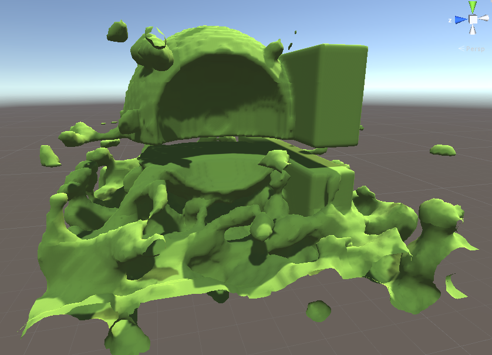
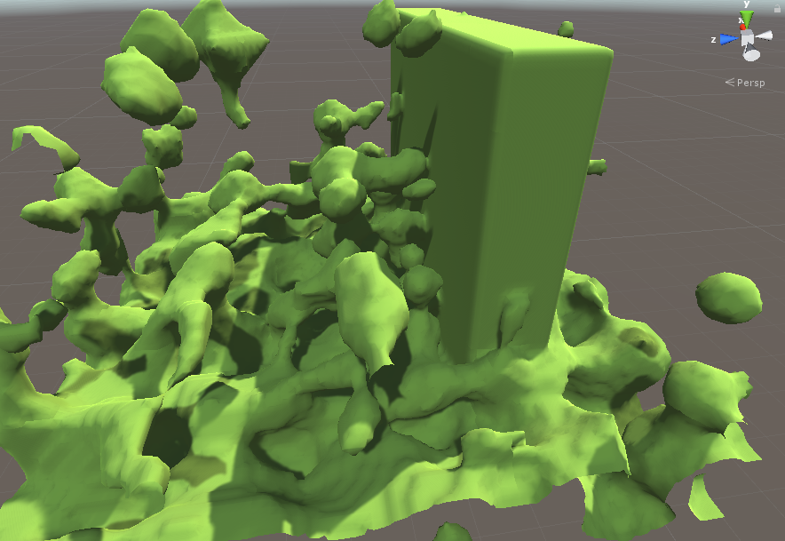
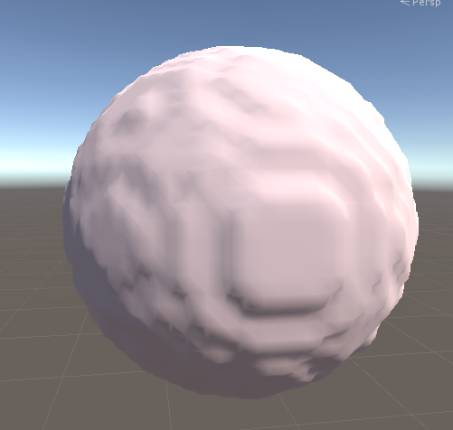
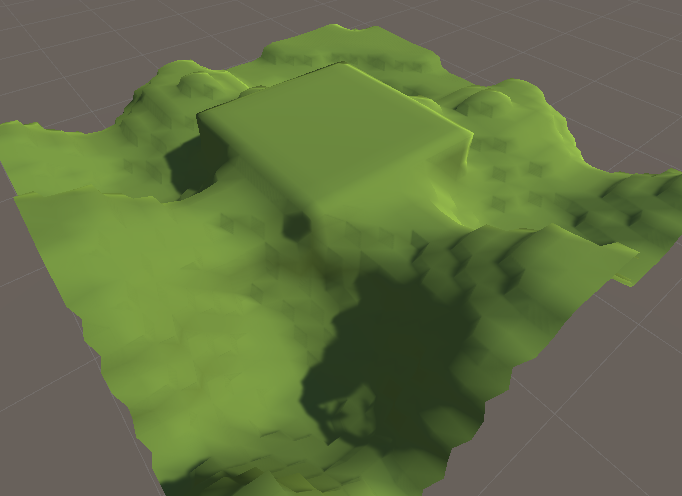
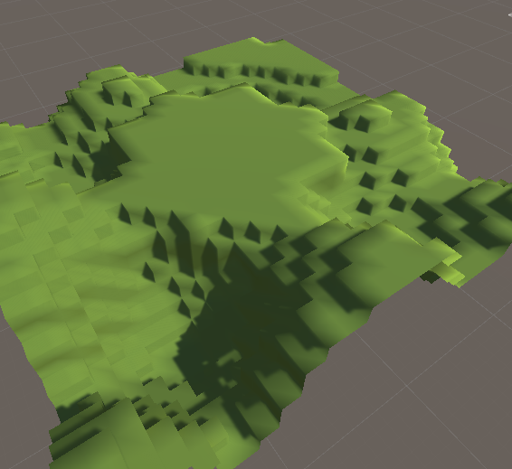

# Isosurface_Extraction

A simple visualization of a grid of voxels using [naive surface nets](https://en.wikipedia.org/wiki/Isosurface#Surface_Nets), implemented in Unity3d.

The visualization can work with voxel data that is changing in real time, for up to 64^3 voxels.

Three-dimensional Perlin noise, with multiple rectangular prisms and spheres added and subtracted from it:

The same noise, with just one prism:

A lone sphere:

Simple 2d noise-based terrain intersecting a box:

An example of isosurface extraction without surface nets:

